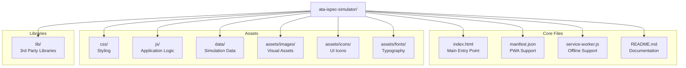

## Hi there 👋


### ATA iSpec 2200 Transformation Simulator: Audience Handout

*GenAI Proposal Status: This document represents a conceptual design generated through AI assistance. Implementation details would require further technical specification and validation by aerospace engineering teams.*

## GAIA-Q-AIR Documentation Transformation Initiative

![GAIA-Q-AIR Logo Placeholder]

### Transforming Aerospace Documentation for the Quantum Age

The GAIA Quantum Aerospace Intelligent Representation (GAIA-Q-AIR) initiative presents a revolutionary approach to aerospace technical documentation. Our ATA iSpec 2200 Transformation Simulator demonstrates how traditional documentation can be transformed into semantically enriched, knowledge-integrated formats that enable next-generation maintenance, training, and regulatory compliance capabilities.

---

## Simulator Highlights

### 1. Semantic Transformation Pipeline

Transform flat documentation into intelligent, interconnected knowledge:

- **Document Ingestion**: Parse ATA iSpec 2200 structured content
- **Content Normalization**: Standardize formats, units, and terminology
- **Entity Recognition**: Identify aerospace components, procedures, and concepts
- **Ontology Alignment**: Map entities to industry-standard aerospace ontologies
- **Validation & QA**: Ensure transformation accuracy and completeness
- **Output Generation**: Create semantically-enriched documentation in multiple formats


### 2. Interactive Knowledge Graph

Visualize complex relationships between aerospace components, procedures, and regulatory requirements:

- **Entity Relationship Mapping**: See how components interact within systems
- **Cross-Reference Navigation**: Navigate between related documents seamlessly
- **Contextual Enrichment**: Access additional information about entities
- **Filtering & Focus**: Isolate specific subsystems or procedure types


### 3. Semantic Annotations

Enhance documentation with intelligent, context-aware annotations:

- **Entity Highlighting**: Visually identify components, procedures, and concepts
- **Tooltip Enrichment**: Access definitions, specifications, and related information
- **Regulatory Linkage**: Connect procedures to relevant regulatory requirements
- **Maintenance History Integration**: Link components to maintenance records


### 4. Configurable Implementation

Tailor the simulator to your organization's specific needs:

- **Content Configuration**: Select transformation stages and features
- **Technical Configuration**: Set compatibility and deployment options
- **Performance Optimization**: Balance detail and performance
- **Branding Customization**: Apply organizational branding
- **Security Controls**: Implement appropriate security measures


---

## Benefits of Semantic Transformation

| Traditional Documentation | Semantically Transformed Documentation
|-----|-----
| Static content | Dynamic, interconnected knowledge
| Format-focused | Meaning-focused
| Siloed information | Integrated knowledge ecosystem
| Linear navigation | Relationship-based exploration
| Manual cross-referencing | Automated relationship discovery
| Text-based search | Semantic query capabilities
| Human-readable only | Both human and machine-readable
| Isolated updates | Propagated changes across related content


---

## Implementation Pathway

1. **Assessment Phase** (2-4 weeks)

1. Document inventory analysis
2. Use case prioritization
3. Technical environment evaluation


2. **Pilot Implementation** (6-8 weeks)

1. Configuration customization
2. Initial document set transformation
3. User acceptance testing


3. **Production Deployment** (3-6 months)

1. Full document set transformation
2. Integration with existing systems
3. User training and adoption support


4. **Continuous Enhancement**

1. Ontology expansion
2. Additional document type support
3. Advanced analytics integration


### Sección 5: Catálogo de Plantillas por INFOCODE

*GenAI Proposal Status: This document represents a conceptual design generated through AI assistance. Implementation details would require further technical specification and validation by aerospace engineering teams.*

## 5.1 OV - Overview (Documento de Visión General)

### 5.1.1 Propósito y Uso

La plantilla OV está diseñada para proporcionar una visión general de alto nivel de un sistema, componente, proyecto o concepto. Se utiliza para introducir el tema a las partes interesadas y establecer un entendimiento común antes de entrar en detalles técnicos.

### 5.1.2 Estructura de la Plantilla

```markdown
---
document_id: [PROJECT_CODE]-[PLATFORM_ID]-[COMPONENT_CHAIN_ID_OR_ATA]-[BITT_REGISTRY_HASH_SHORT]-OV-[REVISION]
title: "Visión General de [Nombre del Sistema/Componente]"
date: YYYY-MM-DD
author: [Nombre del Autor]
contributors: [Lista de Contribuidores]
revision: [Número de Revisión]
status: [draft|review|approved|superseded]
classification: [unclassified|restricted|confidential|secret]
---

# Visión General de [Nombre del Sistema/Componente]

## Resumen Ejecutivo
[Breve descripción del propósito y alcance del sistema/componente en 2-3 párrafos]

## Contexto del Sistema
[Descripción del entorno operativo y cómo se integra con otros sistemas]

## Capacidades Principales
[Lista y descripción breve de las capacidades clave]

## Arquitectura de Alto Nivel
[Diagrama y descripción de la arquitectura general]

## Tecnologías Utilizadas
[Resumen de las tecnologías principales empleadas]

## Consideraciones Operativas
[Aspectos importantes para la operación del sistema]

## Referencias
[Referencias a otros documentos relevantes]

## Historial de Revisiones
| Revisión | Fecha | Autor | Descripción de Cambios |
|----------|-------|-------|------------------------|
| 001      | YYYY-MM-DD | [Autor] | Versión inicial |
```

### 5.1.3 Consideraciones Especiales

- El documento OV debe ser accesible para audiencias técnicas y no técnicas.
- Evite detalles de implementación excesivos; estos pertenecen a documentos SPEC o SDD.
- Incluya diagramas conceptuales para facilitar la comprensión.


## 5.2 SPEC - Specification (Especificación)

### 5.2.1 Propósito y Uso

La plantilla SPEC se utiliza para documentar requisitos detallados, especificaciones técnicas y criterios de aceptación de un sistema o componente. Define "qué" debe hacer el sistema.

### 5.2.2 Estructura de la Plantilla

```markdown
---
document_id: [PROJECT_CODE]-[PLATFORM_ID]-[COMPONENT_CHAIN_ID_OR_ATA]-[BITT_REGISTRY_HASH_SHORT]-SPEC-[REVISION]
title: "Especificación de [Nombre del Sistema/Componente]"
date: YYYY-MM-DD
author: [Nombre del Autor]
contributors: [Lista de Contribuidores]
revision: [Número de Revisión]
status: [draft|review|approved|superseded]
classification: [unclassified|restricted|confidential|secret]
---

# Especificación de [Nombre del Sistema/Componente]

## 1. Introducción
### 1.1 Propósito
[Descripción del propósito de esta especificación]

### 1.2 Alcance
[Definición del alcance de esta especificación]

### 1.3 Definiciones y Acrónimos
[Lista de términos y acrónimos relevantes]

## 2. Descripción General
[Visión general del sistema/componente]

## 3. Requisitos Funcionales
[Listado detallado de requisitos funcionales con identificadores únicos]

## 4. Requisitos No Funcionales
### 4.1 Rendimiento
[Requisitos de rendimiento]

### 4.2 Seguridad
[Requisitos de seguridad]

### 4.3 Fiabilidad
[Requisitos de fiabilidad]

### 4.4 Mantenibilidad
[Requisitos de mantenibilidad]

### 4.5 Otros Requisitos No Funcionales
[Otros requisitos no funcionales relevantes]

## 5. Interfaces
### 5.1 Interfaces de Usuario
[Especificaciones de interfaces de usuario]

### 5.2 Interfaces de Hardware
[Especificaciones de interfaces de hardware]

### 5.3 Interfaces de Software
[Especificaciones de interfaces de software]

### 5.4 Interfaces de Comunicación
[Especificaciones de interfaces de comunicación]

## 6. Criterios de Aceptación
[Criterios para determinar si el sistema cumple con los requisitos]

## 7. Apéndices
[Información adicional relevante]

## Historial de Revisiones
| Revisión | Fecha | Autor | Descripción de Cambios |
|----------|-------|-------|------------------------|
| 001      | YYYY-MM-DD | [Autor] | Versión inicial |
```

### 5.2.3 Consideraciones Especiales

- Cada requisito debe tener un identificador único y ser trazable.
- Los requisitos deben ser claros, concisos, verificables y no ambiguos.
- Evite mezclar requisitos con soluciones de diseño.


## 5.3 SDD - Software Design Document (Documento de Diseño de Software)

### 5.3.1 Propósito y Uso

La plantilla SDD se utiliza para documentar el diseño detallado de un componente de software, describiendo "cómo" se implementará la solución para cumplir con los requisitos especificados en el SPEC.

### 5.3.2 Estructura de la Plantilla

```markdown
---
document_id: [PROJECT_CODE]-[PLATFORM_ID]-[COMPONENT_CHAIN_ID_OR_ATA]-[BITT_REGISTRY_HASH_SHORT]-SDD-[REVISION]
title: "Documento de Diseño de Software: [Nombre del Componente]"
date: YYYY-MM-DD
author: [Nombre del Autor]
contributors: [Lista de Contribuidores]
revision: [Número de Revisión]
status: [draft|review|approved|superseded]
classification: [unclassified|restricted|confidential|secret]
---

# Documento de Diseño de Software: [Nombre del Componente]

## 1. Introducción
### 1.1 Propósito
[Propósito de este documento de diseño]

### 1.2 Alcance
[Alcance del diseño documentado]

### 1.3 Referencias
[Referencias a documentos relacionados, especialmente SPEC]

### 1.4 Definiciones y Acrónimos
[Términos técnicos y acrónimos utilizados]

## 2. Visión General del Diseño
### 2.1 Contexto del Sistema
[Descripción de cómo el componente se integra en el sistema más amplio]

### 2.2 Decisiones de Diseño
[Principales decisiones de diseño y su justificación]

### 2.3 Patrones Arquitectónicos
[Patrones de diseño utilizados]

## 3. Diseño Detallado
### 3.1 Componentes del Sistema
[Descripción detallada de cada componente]

### 3.2 Estructura de Datos
[Diseño de estructuras de datos clave]

### 3.3 Interfaces
[Especificación detallada de interfaces]

### 3.4 Algoritmos
[Descripción de algoritmos importantes]

## 4. Diagramas de Diseño
### 4.1 Diagramas de Clases/Componentes
[Diagramas UML o similares]

### 4.2 Diagramas de Secuencia
[Diagramas de secuencia para flujos importantes]

### 4.3 Diagramas de Estado
[Diagramas de estado si aplica]

## 5. Consideraciones de Implementación
### 5.1 Lenguajes y Tecnologías
[Lenguajes de programación y tecnologías a utilizar]

### 5.2 Dependencias
[Bibliotecas y frameworks necesarios]

### 5.3 Limitaciones y Restricciones
[Limitaciones técnicas o de entorno]

## 6. Estrategia de Pruebas
[Enfoque para probar el diseño]

## Historial de Revisiones
| Revisión | Fecha | Autor | Descripción de Cambios |
|----------|-------|-------|------------------------|
| 001      | YYYY-MM-DD | [Autor] | Versión inicial |
```

### 5.3.3 Consideraciones Especiales

- Incluya diagramas claros que ilustren la arquitectura y los flujos de datos.
- Mantenga la trazabilidad con los requisitos del documento SPEC.
- Documente las razones detrás de las decisiones de diseño importantes.


## 5.4 PROC - Procedure (Procedimiento)

### 5.4.1 Propósito y Uso

La plantilla PROC se utiliza para documentar procedimientos paso a paso para operaciones, mantenimiento, instalación, configuración u otras actividades técnicas.

### 5.4.2 Estructura de la Plantilla

```markdown
---
document_id: [PROJECT_CODE]-[PLATFORM_ID]-[COMPONENT_CHAIN_ID_OR_ATA]-[BITT_REGISTRY_HASH_SHORT]-PROC-[REVISION]
title: "Procedimiento para [Nombre de la Actividad]"
date: YYYY-MM-DD
author: [Nombre del Autor]
contributors: [Lista de Contribuidores]
revision: [Número de Revisión]
status: [draft|review|approved|superseded]
classification: [unclassified|restricted|confidential|secret]
---

# Procedimiento para [Nombre de la Actividad]

## 1. Introducción
### 1.1 Propósito
[Propósito de este procedimiento]

### 1.2 Alcance
[Alcance de las actividades cubiertas]

### 1.3 Audiencia Objetivo
[Personal al que va dirigido este procedimiento]

## 2. Prerrequisitos
### 2.1 Conocimientos Requeridos
[Conocimientos necesarios para ejecutar el procedimiento]

### 2.2 Herramientas y Materiales
[Lista de herramientas, software, materiales necesarios]

### 2.3 Documentación Relacionada
[Referencias a otros documentos relevantes]

## 3. Precauciones y Advertencias
[Advertencias de seguridad, riesgos potenciales, precauciones]

## 4. Procedimiento
### 4.1 Preparación
[Pasos preparatorios]

### 4.2 Ejecución
[Pasos detallados del procedimiento principal]
1. [Paso 1]
2. [Paso 2]
   a. [Subpaso a]
   b. [Subpaso b]
3. [Paso 3]

### 4.3 Verificación
[Pasos para verificar que el procedimiento se ha completado correctamente]

### 4.4 Finalización
[Pasos finales, limpieza, documentación]

## 5. Resolución de Problemas
[Problemas comunes y sus soluciones]

## 6. Apéndices
[Información adicional relevante]

## Historial de Revisiones
| Revisión | Fecha | Autor | Descripción de Cambios |
|----------|-------|-------|------------------------|
| 001      | YYYY-MM-DD | [Autor] | Versión inicial |
```

### 5.4.3 Consideraciones Especiales

- Los pasos deben ser claros, concisos y en orden secuencial.
- Incluya capturas de pantalla o diagramas cuando sea necesario para clarificar los pasos.
- Destaque claramente las advertencias y precauciones de seguridad.


## 5.5 RPT - Report (Informe)

### 5.5.1 Propósito y Uso

La plantilla RPT se utiliza para documentar resultados de pruebas, análisis, investigaciones o evaluaciones. Proporciona un registro formal de hallazgos y conclusiones.

### 5.5.2 Estructura de la Plantilla

```markdown
---
document_id: [PROJECT_CODE]-[PLATFORM_ID]-[COMPONENT_CHAIN_ID_OR_ATA]-[BITT_REGISTRY_HASH_SHORT]-RPT-[REVISION]
title: "Informe de [Tipo de Informe]"
date: YYYY-MM-DD
author: [Nombre del Autor]
contributors: [Lista de Contribuidores]
revision: [Número de Revisión]
status: [draft|review|approved|superseded]
classification: [unclassified|restricted|confidential|secret]
---

# Informe de [Tipo de Informe]

## 1. Resumen Ejecutivo
[Resumen conciso de los principales hallazgos y conclusiones]

## 2. Introducción
### 2.1 Antecedentes
[Contexto y antecedentes relevantes]

### 2.2 Objetivos
[Objetivos específicos de este informe]

### 2.3 Alcance
[Alcance de la actividad reportada]

## 3. Metodología
[Descripción de los métodos, herramientas y enfoques utilizados]

## 4. Resultados
[Presentación detallada de los resultados obtenidos]

## 5. Análisis
[Interpretación y análisis de los resultados]

## 6. Conclusiones
[Conclusiones derivadas del análisis]

## 7. Recomendaciones
[Recomendaciones basadas en las conclusiones]

## 8. Referencias
[Referencias a documentos, estándares o fuentes utilizadas]

## 9. Apéndices
[Datos adicionales, gráficos, tablas detalladas]

## Historial de Revisiones
| Revisión | Fecha | Autor | Descripción de Cambios |
|----------|-------|-------|------------------------|
| 001      | YYYY-MM-DD | [Autor] | Versión inicial |
```

### 5.5.3 Consideraciones Especiales

- Presente los datos de manera clara y objetiva.
- Incluya visualizaciones (gráficos, tablas) para facilitar la comprensión de los datos.
- Distinga claramente entre resultados objetivos y análisis/interpretaciones.


## 5.6 REQ - Requirements (Requisitos)

### 5.6.1 Propósito y Uso

La plantilla REQ se utiliza para documentar requisitos de usuario o de sistema de manera estructurada, facilitando la trazabilidad y gestión de requisitos.

### 5.6.2 Estructura de la Plantilla

```markdown
---
document_id: [PROJECT_CODE]-[PLATFORM_ID]-[COMPONENT_CHAIN_ID_OR_ATA]-[BITT_REGISTRY_HASH_SHORT]-REQ-[REVISION]
title: "Documento de Requisitos: [Nombre del Sistema/Componente]"
date: YYYY-MM-DD
author: [Nombre del Autor]
contributors: [Lista de Contribuidores]
revision: [Número de Revisión]
status: [draft|review|approved|superseded]
classification: [unclassified|restricted|confidential|secret]
---

# Documento de Requisitos: [Nombre del Sistema/Componente]

## 1. Introducción
### 1.1 Propósito
[Propósito de este documento de requisitos]

### 1.2 Alcance
[Alcance del sistema o componente]

### 1.3 Definiciones y Acrónimos
[Términos y acrónimos relevantes]

## 2. Descripción General
[Visión general del sistema o componente]

## 3. Requisitos Funcionales
[Tabla de requisitos funcionales]

| ID | Descripción | Prioridad | Fuente | Estado |
|----|-------------|-----------|--------|--------|
| RF-001 | [Descripción del requisito] | [Alta/Media/Baja] | [Origen] | [Propuesto/Aprobado/Implementado/Verificado] |
| RF-002 | [Descripción del requisito] | [Alta/Media/Baja] | [Origen] | [Propuesto/Aprobado/Implementado/Verificado] |

## 4. Requisitos No Funcionales
[Tabla de requisitos no funcionales]

| ID | Tipo | Descripción | Prioridad | Fuente | Estado |
|----|------|-------------|-----------|--------|--------|
| RNF-001 | [Rendimiento/Seguridad/etc.] | [Descripción] | [Alta/Media/Baja] | [Origen] | [Estado] |
| RNF-002 | [Rendimiento/Seguridad/etc.] | [Descripción] | [Alta/Media/Baja] | [Origen] | [Estado] |

## 5. Restricciones
[Lista de restricciones técnicas, de negocio, regulatorias, etc.]

## 6. Matriz de Trazabilidad
[Matriz que relaciona requisitos con otros artefactos]

## 7. Apéndices
[Información adicional relevante]

## Historial de Revisiones
| Revisión | Fecha | Autor | Descripción de Cambios |
|----------|-------|-------|------------------------|
| 001      | YYYY-MM-DD | [Autor] | Versión inicial |
```

### 5.6.3 Consideraciones Especiales

- Cada requisito debe tener un identificador único.
- Los requisitos deben ser atómicos, completos, consistentes, verificables y no ambiguos.
- Mantenga actualizada la matriz de trazabilidad.


## 5.7 TESTPLAN - Test Plan (Plan de Pruebas)

### 5.7.1 Propósito y Uso

La plantilla TESTPLAN se utiliza para documentar la estrategia, alcance, recursos y cronograma para actividades de prueba de un sistema o componente.

### 5.7.2 Estructura de la Plantilla

```markdown
---
document_id: [PROJECT_CODE]-[PLATFORM_ID]-[COMPONENT_CHAIN_ID_OR_ATA]-[BITT_REGISTRY_HASH_SHORT]-TESTPLAN-[REVISION]
title: "Plan de Pruebas: [Nombre del Sistema/Componente]"
date: YYYY-MM-DD
author: [Nombre del Autor]
contributors: [Lista de Contribuidores]
revision: [Número de Revisión]
status: [draft|review|approved|superseded]
classification: [unclassified|restricted|confidential|secret]
---

# Plan de Pruebas: [Nombre del Sistema/Componente]

## 1. Introducción
### 1.1 Propósito
[Propósito de este plan de pruebas]

### 1.2 Alcance
[Alcance de las pruebas]

### 1.3 Referencias
[Referencias a documentos relacionados]

## 2. Estrategia de Pruebas
### 2.1 Objetivos de Prueba
[Objetivos específicos de las pruebas]

### 2.2 Tipos de Prueba
[Tipos de pruebas a realizar: unitarias, integración, sistema, aceptación, etc.]

### 2.3 Entornos de Prueba
[Descripción de los entornos donde se realizarán las pruebas]

## 3. Elementos a Probar
[Lista de componentes, funcionalidades o requisitos a probar]

## 4. Criterios de Prueba
### 4.1 Criterios de Entrada
[Condiciones que deben cumplirse antes de iniciar las pruebas]

### 4.2 Criterios de Salida
[Condiciones que deben cumplirse para considerar las pruebas completadas]

### 4.3 Criterios de Suspensión y Reanudación
[Condiciones para suspender y reanudar las pruebas]

## 5. Casos de Prueba
[Resumen de los casos de prueba o referencia a documentos de casos de prueba]

| ID | Descripción | Requisitos Cubiertos | Precondiciones | Pasos | Resultado Esperado |
|----|-------------|----------------------|----------------|-------|-------------------|
| TC-001 | [Descripción] | [RF-001, RF-002] | [Precondiciones] | [Pasos] | [Resultado esperado] |

## 6. Cronograma
[Cronograma de actividades de prueba]

## 7. Recursos
### 7.1 Personal
[Personal necesario y sus roles]

### 7.2 Herramientas
[Herramientas de prueba necesarias]

### 7.3 Entorno
[Requisitos de entorno]

## 8. Riesgos y Mitigaciones
[Riesgos identificados y estrategias de mitigación]

## 9. Apéndices
[Información adicional relevante]

## Historial de Revisiones
| Revisión | Fecha | Autor | Descripción de Cambios |
|----------|-------|-------|------------------------|
| 001      | YYYY-MM-DD | [Autor] | Versión inicial |
```

### 5.7.3 Consideraciones Especiales

- Asegúrese de que los casos de prueba cubran todos los requisitos.
- Defina claramente los criterios de éxito/fracaso para cada prueba.
- Considere la automatización de pruebas cuando sea apropiado.


## 5.8 TESTCASE - Test Cases (Casos de Prueba)

### 5.8.1 Propósito y Uso

La plantilla TESTCASE se utiliza para documentar casos de prueba detallados que verifican el cumplimiento de requisitos específicos.

### 5.8.2 Estructura de la Plantilla

```markdown
---
document_id: [PROJECT_CODE]-[PLATFORM_ID]-[COMPONENT_CHAIN_ID_OR_ATA]-[BITT_REGISTRY_HASH_SHORT]-TESTCASE-[REVISION]
title: "Casos de Prueba: [Nombre del Sistema/Componente]"
date: YYYY-MM-DD
author: [Nombre del Autor]
contributors: [Lista de Contribuidores]
revision: [Número de Revisión]
status: [draft|review|approved|superseded]
classification: [unclassified|restricted|confidential|secret]
---

# Casos de Prueba: [Nombre del Sistema/Componente]

## 1. Introducción
### 1.1 Propósito
[Propósito de este documento de casos de prueba]

### 1.2 Alcance
[Alcance de los casos de prueba documentados]

### 1.3 Referencias
[Referencias a documentos relacionados, especialmente TESTPLAN y REQ]

## 2. Casos de Prueba

### TC-001: [Nombre del Caso de Prueba]
**Objetivo:** [Objetivo del caso de prueba]  
**Requisitos Cubiertos:** [Lista de IDs de requisitos verificados por este caso]  
**Precondiciones:**
- [Precondición 1]
- [Precondición 2]

**Pasos:**
1. [Paso 1]
2. [Paso 2]
3. [Paso 3]

**Resultado Esperado:**
- [Resultado esperado 1]
- [Resultado esperado 2]

**Datos de Prueba:**
- [Datos de entrada específicos]

**Notas:**
- [Notas adicionales]

### TC-002: [Nombre del Caso de Prueba]
**Objetivo:** [Objetivo del caso de prueba]  
**Requisitos Cubiertos:** [Lista de IDs de requisitos verificados por este caso]  
**Precondiciones:**
- [Precondición 1]
- [Precondición 2]

**Pasos:**
1. [Paso 1]
2. [Paso 2]
3. [Paso 3]

**Resultado Esperado:**
- [Resultado esperado 1]
- [Resultado esperado 2]

**Datos de Prueba:**
- [Datos de entrada específicos]

**Notas:**
- [Notas adicionales]

## 3. Matriz de Trazabilidad
[Matriz que relaciona casos de prueba con requisitos]

| Caso de Prueba | Requisitos Cubiertos |
|----------------|----------------------|
| TC-001         | RF-001, RF-002       |
| TC-002         | RF-003               |

## Historial de Revisiones
| Revisión | Fecha | Autor | Descripción de Cambios |
|----------|-------|-------|------------------------|
| 001      | YYYY-MM-DD | [Autor] | Versión inicial |
```

### 5.8.3 Consideraciones Especiales

- Los pasos deben ser detallados y reproducibles.
- Especifique claramente los datos de prueba necesarios.
- Mantenga la trazabilidad con los requisitos.


## 5.9 MOM - Minutes of Meeting (Acta de Reunión)

### 5.9.1 Propósito y Uso

La plantilla MOM se utiliza para documentar formalmente las discusiones, decisiones y acciones acordadas durante reuniones de proyecto.

### 5.9.2 Estructura de la Plantilla

```markdown
---
document_id: [PROJECT_CODE]-[PLATFORM_ID]-[COMPONENT_CHAIN_ID_OR_ATA]-[BITT_REGISTRY_HASH_SHORT]-MOM-[REVISION]
title: "Acta de Reunión: [Título de la Reunión]"
date: YYYY-MM-DD
author: [Nombre del Autor]
contributors: [Lista de Contribuidores]
revision: [Número de Revisión]
status: [draft|review|approved|superseded]
classification: [unclassified|restricted|confidential|secret]
---

# Acta de Reunión: [Título de la Reunión]

## 1. Información de la Reunión
**Fecha:** [Fecha de la reunión]  
**Hora:** [Hora de inicio] - [Hora de finalización]  
**Ubicación:** [Lugar físico o plataforma virtual]  
**Tipo de Reunión:** [Regular/Extraordinaria/Seguimiento/etc.]

## 2. Participantes
### 2.1 Asistentes
- [Nombre], [Rol/Organización]
- [Nombre], [Rol/Organización]

### 2.2 Ausentes
- [Nombre], [Rol/Organización]

## 3. Agenda
1. [Tema 1]
2. [Tema 2]
3. [Tema 3]

## 4. Discusiones y Decisiones

### 4.1 [Tema 1]
**Discusión:**
[Resumen de la discusión]

**Decisiones:**
- [Decisión 1]
- [Decisión 2]

### 4.2 [Tema 2]
**Discusión:**
[Resumen de la discusión]

**Decisiones:**
- [Decisión 1]
- [Decisión 2]

## 5. Elementos de Acción
| ID | Acción | Responsable | Fecha Límite | Estado |
|----|--------|-------------|--------------|--------|
| A-001 | [Descripción de la acción] | [Responsable] | [Fecha] | [Pendiente/En progreso/Completado] |
| A-002 | [Descripción de la acción] | [Responsable] | [Fecha] | [Pendiente/En progreso/Completado] |

## 6. Próxima Reunión
**Fecha:** [Fecha de la próxima reunión]  
**Hora:** [Hora de inicio] - [Hora de finalización]  
**Ubicación:** [Lugar físico o plataforma virtual]  
**Agenda Preliminar:**
1. [Tema 1]
2. [Tema 2]

## Historial de Revisiones
| Revisión | Fecha | Autor | Descripción de Cambios |
|----------|-------|-------|------------------------|
| 001      | YYYY-MM-DD | [Autor] | Versión inicial |
```

### 5.9.3 Consideraciones Especiales

- Distribuya el acta lo antes posible después de la reunión.
- Asegúrese de que todas las decisiones y acciones estén claramente documentadas.
- Obtenga aprobación de los participantes antes de finalizar el acta.


## 5.10 TN - Technical Note (Nota Técnica)

### 5.10.1 Propósito y Uso

La plantilla TN se utiliza para documentar información técnica específica, análisis, investigaciones o soluciones a problemas que no encajan en otras categorías de documentos.

### 5.10.2 Estructura de la Plantilla

```markdown
---
document_id: [PROJECT_CODE]-[PLATFORM_ID]-[COMPONENT_CHAIN_ID_OR_ATA]-[BITT_REGISTRY_HASH_SHORT]-TN-[REVISION]
title: "Nota Técnica: [Título de la Nota]"
date: YYYY-MM-DD
author: [Nombre del Autor]
contributors: [Lista de Contribuidores]
revision: [Número de Revisión]
status: [draft|review|approved|superseded]
classification: [unclassified|restricted|confidential|secret]
---

# Nota Técnica: [Título de la Nota]

## 1. Introducción
### 1.1 Propósito
[Propósito de esta nota técnica]

### 1.2 Alcance
[Alcance de la información presentada]

### 1.3 Referencias
[Referencias a documentos relacionados]

## 2. Antecedentes
[Contexto necesario para entender el tema]

## 3. Descripción Técnica
[Descripción detallada del tema técnico]

## 4. Análisis
[Análisis técnico, cálculos, evaluaciones]

## 5. Conclusiones
[Conclusiones derivadas del análisis]

## 6. Recomendaciones
[Recomendaciones técnicas basadas en las conclusiones]

## 7. Apéndices
[Información técnica adicional, código, diagramas]

## Historial de Revisiones
| Revisión | Fecha | Autor | Descripción de Cambios |
|----------|-------|-------|------------------------|
| 001      | YYYY-MM-DD | [Autor] | Versión inicial |
```

### 5.10.3 Consideraciones Especiales

- Sea preciso y técnicamente riguroso.
- Incluya diagramas, código o fórmulas cuando sea necesario para clarificar conceptos técnicos.
- Documente claramente los supuestos técnicos realizados.


## 5.11 UM - User Manual (Manual de Usuario)

### 5.11.1 Propósito y Uso

La plantilla UM se utiliza para crear manuales de usuario que proporcionan instrucciones sobre cómo utilizar un sistema, aplicación o dispositivo.

### 5.11.2 Estructura de la Plantilla

```markdown
---
document_id: [PROJECT_CODE]-[PLATFORM_ID]-[COMPONENT_CHAIN_ID_OR_ATA]-[BITT_REGISTRY_HASH_SHORT]-UM-[REVISION]
title: "Manual de Usuario: [Nombre del Sistema/Aplicación]"
date: YYYY-MM-DD
author: [Nombre del Autor]
contributors: [Lista de Contribuidores]
revision: [Número de Revisión]
status: [draft|review|approved|superseded]
classification: [unclassified|restricted|confidential|secret]
---

# Manual de Usuario: [Nombre del Sistema/Aplicación]

## 1. Introducción
### 1.1 Acerca de [Nombre del Sistema/Aplicación]
[Descripción general del sistema o aplicación]

### 1.2 Audiencia
[Usuarios a los que va dirigido este manual]

### 1.3 Convenciones del Documento
[Explicación de convenciones utilizadas en el manual]

## 2. Primeros Pasos
### 2.1 Requisitos del Sistema
[Requisitos de hardware y software]

### 2.2 Instalación
[Instrucciones de instalación]

### 2.3 Acceso al Sistema
[Cómo acceder al sistema o iniciar la aplicación]

## 3. Interfaz de Usuario
### 3.1 Visión General
[Descripción general de la interfaz]

### 3.2 Elementos de la Interfaz
[Descripción de los principales elementos de la interfaz]

## 4. Funcionalidades
### 4.1 [Funcionalidad 1]
[Descripción detallada de la funcionalidad]
[Instrucciones paso a paso con capturas de pantalla]

### 4.2 [Funcionalidad 2]
[Descripción detallada de la funcionalidad]
[Instrucciones paso a paso con capturas de pantalla]

## 5. Escenarios de Uso Común
[Guías paso a paso para escenarios de uso frecuentes]

## 6. Resolución de Problemas
[Problemas comunes y sus soluciones]

## 7. Glosario
[Definiciones de términos utilizados en el manual]

## 8. Apéndices
[Información adicional relevante]

## Historial de Revisiones
| Revisión | Fecha | Autor | Descripción de Cambios |
|----------|-------|-------|------------------------|
| 001      | YYYY-MM-DD | [Autor] | Versión inicial |
```

### 5.11.3 Consideraciones Especiales

- Utilice un lenguaje claro y accesible para el usuario final.
- Incluya abundantes capturas de pantalla y diagramas.
- Organice la información de manera que facilite tanto la lectura secuencial como la consulta rápida.


## 5.12 MAINT - Maintenance Manual (Manual de Mantenimiento)

### 5.12.1 Propósito y Uso

La plantilla MAINT se utiliza para documentar procedimientos de mantenimiento, solución de problemas y reparación de sistemas o equipos.

### 5.12.2 Estructura de la Plantilla

```markdown
---
document_id: [PROJECT_CODE]-[PLATFORM_ID]-[COMPONENT_CHAIN_ID_OR_ATA]-[BITT_REGISTRY_HASH_SHORT]-MAINT-[REVISION]
title: "Manual de Mantenimiento: [Nombre del Sistema/Equipo]"
date: YYYY-MM-DD
author: [Nombre del Autor]
contributors: [Lista de Contribuidores]
revision: [Número de Revisión]
status: [draft|review|approved|superseded]
classification: [unclassified|restricted|confidential|secret]
---

# Manual de Mantenimiento: [Nombre del Sistema/Equipo]

## 1. Introducción
### 1.1 Propósito
[Propósito de este manual de mantenimiento]

### 1.2 Alcance
[Alcance de los procedimientos de mantenimiento cubiertos]

### 1.3 Audiencia
[Personal al que va dirigido este manual]

### 1.4 Advertencias y Precauciones
[Advertencias generales de seguridad y precauciones]

## 2. Descripción del Sistema
### 2.1 Visión General
[Descripción general del sistema o equipo]

### 2.2 Componentes Principales
[Descripción de los componentes principales]

### 2.3 Especificaciones Técnicas
[Especificaciones técnicas relevantes para el mantenimiento]

## 3. Mantenimiento Preventivo
### 3.1 Programa de Mantenimiento
[Cronograma recomendado de mantenimiento preventivo]

### 3.2 Procedimientos de Inspección
[Procedimientos detallados para inspecciones periódicas]

### 3.3 Procedimientos de Limpieza
[Procedimientos detallados para limpieza]

### 3.4 Procedimientos de Lubricación
[Procedimientos detallados para lubricación]

## 4. Mantenimiento Correctivo
### 4.1 Diagnóstico de Problemas
[Guía para diagnosticar problemas comunes]

### 4.2 Procedimientos de Reparación
[Procedimientos detallados para reparaciones comunes]

### 4.3 Reemplazo de Componentes
[Procedimientos para reemplazar componentes]

## 5. Herramientas y Repuestos
### 5.1 Herramientas Requeridas
[Lista de herramientas necesarias]

### 5.2 Repuestos Recomendados
[Lista de repuestos recomendados]

## 6. Diagramas y Esquemas
[Diagramas técnicos, esquemas eléctricos, etc.]

## 7. Apéndices
[Información adicional relevante]

## Historial de Revisiones
| Revisión | Fecha | Autor | Descripción de Cambios |
|----------|-------|-------|------------------------|
| 001      | YYYY-MM-DD | [Autor] | Versión inicial |
```

### 5.12.3 Consideraciones Especiales

- Incluya advertencias de seguridad claras y destacadas.
- Proporcione diagramas técnicos precisos.
- Especifique claramente las herramientas y repuestos necesarios.


## 5.13 QRG - Quick Reference Guide (Guía de Referencia Rápida)

### 5.13.1 Propósito y Uso

La plantilla QRG se utiliza para crear guías concisas que proporcionan información esencial de manera rápida y accesible.

### 5.13.2 Estructura de la Plantilla

```markdown
---
document_id: [PROJECT_CODE]-[PLATFORM_ID]-[COMPONENT_CHAIN_ID_OR_ATA]-[BITT_REGISTRY_HASH_SHORT]-QRG-[REVISION]
title: "Guía de Referencia Rápida: [Tema]"
date: YYYY-MM-DD
author: [Nombre del Autor]
contributors: [Lista de Contribuidores]
revision: [Número de Revisión]
status: [draft|review|approved|superseded]
classification: [unclassified|restricted|confidential|secret]
---

# Guía de Referencia Rápida: [Tema]

## Propósito
[Breve descripción del propósito de esta guía]

## Información Clave

### [Categoría 1]
- [Información clave 1]
- [Información clave 2]
- [Información clave 3]

### [Categoría 2]
- [Información clave 1]
- [Información clave 2]
- [Información clave 3]

## Procedimientos Comunes

### [Procedimiento 1]
1. [Paso 1]
2. [Paso 2]
3. [Paso 3]

### [Procedimiento 2]
1. [Paso 1]
2. [Paso 2]
3. [Paso 3]

## Referencias Rápidas

### [Referencia 1]
[Información de referencia rápida]

### [Referencia 2]
[Información de referencia rápida]

## Contactos Clave
- [Nombre], [Rol], [Contacto]
- [Nombre], [Rol], [Contacto]

## Historial de Revisiones
| Revisión | Fecha | Autor | Descripción de Cambios |
|----------|-------|-------|------------------------|
| 001      | YYYY-MM-DD | [Autor] | Versión inicial |
```

### 5.13.3 Consideraciones Especiales

- Mantenga la guía concisa y enfocada en información esencial.
- Utilice listas, tablas y diagramas para facilitar la consulta rápida.
- Evite detalles innecesarios que puedan dificultar el acceso rápido a la información clave.


## 5.14 CHKLIST - Checklist (Lista de Verificación)

### 5.14.1 Propósito y Uso

La plantilla CHKLIST se utiliza para crear listas de verificación estructuradas para procesos, revisiones o actividades que requieren una verificación sistemática de elementos.

### 5.14.2 Estructura de la Plantilla

```markdown
---
document_id: [PROJECT_CODE]-[PLATFORM_ID]-[COMPONENT_CHAIN_ID_OR_ATA]-[BITT_REGISTRY_HASH_SHORT]-CHKLIST-[REVISION]
title: "Lista de Verificación: [Nombre de la Actividad]"
date: YYYY-MM-DD
author: [Nombre del Autor]
contributors: [Lista de Contribuidores]
revision: [Número de Revisión]
status: [draft|review|approved|superseded]
classification: [unclassified|restricted|confidential|secret]
---

# Lista de Verificación: [Nombre de la Actividad]

## Información General
**Propósito:** [Propósito de esta lista de verificación]  
**Aplicabilidad:** [Cuándo debe utilizarse esta lista]  
**Prerrequisitos:** [Condiciones previas necesarias]

## Instrucciones
1. [Instrucción 1 para el uso de la lista]
2. [Instrucción 2 para el uso de la lista]

## Lista de Verificación

### 1. [Categoría 1]

| # | Elemento | Criterio de Verificación | Estado | Comentarios |
|---|----------|--------------------------|--------|------------|
| 1.1 | [Elemento] | [Criterio] | □ Conforme<br>□ No Conforme<br>□ N/A | |
| 1.2 | [Elemento] | [Criterio] | □ Conforme<br>□ No Conforme<br>□ N/A | |
| 1.3 | [Elemento] | [Criterio] | □ Conforme<br>□ No Conforme<br>□ N/A | |

### 2. [Categoría 2]

| # | Elemento | Criterio de Verificación | Estado | Comentarios |
|---|----------|--------------------------|--------|------------|
| 2.1 | [Elemento] | [Criterio] | □ Conforme<br>□ No Conforme<br>□ N/A | |
| 2.2 | [Elemento] | [Criterio] | □ Conforme<br>□ No Conforme<br>□ N/A | |
| 2.3 | [Elemento] | [Criterio] | □ Conforme<br>□ No Conforme<br>□ N/A | |

## Resumen de Resultados
**Total de Elementos:** [Número total]  
**Conformes:** [Número]  
**No Conformes:** [Número]  
**No Aplicables:** [Número]  
**Resultado Final:** □ Aprobado □ No Aprobado

## Aprobación
**Verificado por:** ________________________ **Fecha:** __________  
**Aprobado por:** _________________________ **Fecha:** __________

## Historial de Revisiones
| Revisión | Fecha | Autor | Descripción de Cambios |
|----------|-------|-------|------------------------|
| 001      | YYYY-MM-DD | [Autor] | Versión inicial |
```

### 5.14.3 Consideraciones Especiales

- Los criterios de verificación deben ser claros y objetivos.
- Incluya espacio para comentarios en cada elemento.
- Organice los elementos en categorías lógicas.


## 5.15 TEMPLATE - Template (Plantilla Base)

### 5.15.1 Propósito y Uso

La plantilla TEMPLATE es una plantilla base genérica que puede utilizarse como punto de partida para crear nuevos tipos de documentos que no encajan en las categorías existentes.

### 5.15.2 Estructura de la Plantilla

```markdown
---
document_id: [PROJECT_CODE]-[PLATFORM_ID]-[COMPONENT_CHAIN_ID_OR_ATA]-[BITT_REGISTRY_HASH_SHORT]-[INFOCODE]-[REVISION]
title: "[Título del Documento]"
date: YYYY-MM-DD
author: [Nombre del Autor]
contributors: [Lista de Contribuidores]
revision: [Número de Revisión]
status: [draft|review|approved|superseded]
classification: [unclassified|restricted|confidential|secret]
---

# [Título del Documento]

## 1. Introducción
### 1.1 Propósito
[Propósito de este documento]

### 1.2 Alcance
[Alcance del documento]

### 1.3 Definiciones y Acrónimos
[Términos y acrónimos relevantes]

## 2. [Sección Principal 1]
### 2.1 [Subsección 1.1]
[Contenido]

### 2.2 [Subsección 1.2]
[Contenido]

## 3. [Sección Principal 2]
### 3.1 [Subsección 2.1]
[Contenido]

### 3.2 [Subsección 2.2]
[Contenido]

## 4. [Sección Principal 3]
[Contenido]

## 5. Referencias
[Referencias a otros documentos]

## Apéndices
### Apéndice A: [Título]
[Contenido]

### Apéndice B: [Título]
[Contenido]

## Historial de Revisiones
| Revisión | Fecha | Autor | Descripción de Cambios |
|----------|-------|-------|------------------------|
| 001      | YYYY-MM-DD | [Autor] | Versión inicial |
```

### 5.15.3 Consideraciones Especiales

- Adapte la estructura según las necesidades específicas del documento.
- Mantenga la consistencia con las convenciones de formato de GAIA-CO-ASD-LIB.
- Documente claramente cualquier desviación de las plantillas estándar.


---

## Ready for a Pilot Project?

The GAIA-Q-AIR team offers a comprehensive pilot package to help your organization experience the benefits of semantic documentation transformation:

- **Customized Simulator**: Configured for your specific documentation needs
- **Sample Document Transformation**: Transform 3-5 of your actual documents
- **Technical Integration Assessment**: Evaluate integration with your existing systems
- **ROI Analysis**: Quantify potential time and cost savings


---

## Contact Information

**Dr. Alexandra Chen**GAIA-Q-AIR Technical Lead[a.chen@gaia-quantum.org](mailto:a.chen@gaia-quantum.org)+1 (555) 123-4567

**Marcus Rodriguez**Implementation Specialist[m.rodriguez@gaia-quantum.org](mailto:m.rodriguez@gaia-quantum.org)+1 (555) 765-4321

---

*© 2025 GAIA Quantum Aerospace Organization. All rights reserved.**Developed in collaboration with the International Aviation Documentation Standards Group and the Semantic Web for Aerospace Research Team.*

---

Would you like me to create any of the other suggested assets, such as a visual slide deck, pilot kit offer details, or impact metrics slide? I'd be happy to develop those materials to complement the presenter's script and this handout.

## 1. Package Manifest Overview



## 2. Detailed File Structure

```plaintext
ata-ispec-simulator/
│
├── index.html                      # Main entry point
├── manifest.json                   # PWA configuration
├── service-worker.js               # Offline support
├── README.md                       # Usage instructions
│
├── css/                            # Styling
│   ├── styles.css                  # Main stylesheet
│   ├── print.css                   # Print-specific styles
│   └── themes/                     # Theme variations
│       ├── light.css               # Light theme
│       └── dark.css                # Dark theme
│
├── js/                             # Application logic
│   ├── simulator.js                # Main application controller
│   ├── config.js                   # Configuration options
│   ├── stages/                     # Stage-specific logic
│   │   ├── stage-manager.js        # Stage navigation controller
│   │   ├── stage-1-ingestion.js    # Document ingestion stage
│   │   ├── stage-2-normalization.js # Content normalization stage
│   │   ├── stage-3-entity.js       # Entity recognition stage
│   │   ├── stage-4-ontology.js     # Ontology alignment stage
│   │   ├── stage-5-validation.js   # Validation & QA stage
│   │   └── stage-6-output.js       # Output generation stage
│   ├── data/                       # Data handling
│   │   ├── data-loader.js          # Data loading utilities
│   │   └── data-processor.js       # Data processing utilities
│   ├── ui/                         # UI components
│   │   ├── ui-controller.js        # UI management
│   │   ├── components/             # Reusable UI components
│   │   └── accessibility.js        # Accessibility enhancements
│   ├── graph/                      # Knowledge graph
│   │   ├── knowledge-graph.js      # Graph visualization
│   │   └── graph-interactions.js   # Graph interaction handlers
│   └── utils/                      # Utility functions
│       ├── export.js               # Export utilities
│       └── helpers.js              # General helper functions
│
├── data/                           # Simulation data
│   ├── document.json               # Sample document structure
│   ├── entities.json               # Entity definitions
│   ├── relationships.json          # Entity relationships
│   ├── ontology.json               # Aerospace ontology
│   ├── validation-rules.json       # Validation rules
│   └── knowledge-graph.json        # Knowledge graph data
│
├── assets/                         # Visual assets
│   ├── images/                     # Images
│   │   ├── illustrations/          # Technical illustrations
│   │   │   ├── hydraulic-system.svg # System schematic
│   │   │   └── component-diagram.svg # Component diagram
│   │   └── screenshots/            # UI screenshots
│   ├── icons/                      # UI icons
│   │   ├── favicon.ico             # Favicon
│   │   ├── logo.svg                # Application logo
│   │   └── stage-icons/            # Stage-specific icons
│   └── fonts/                      # Typography
│       ├── roboto/                 # Roboto font family
│       └── source-code-pro/        # Source Code Pro for code blocks
│
└── lib/                            # 3rd party libraries
    ├── d3.min.js                   # D3.js for visualizations
    ├── pdf-lib.min.js              # PDF generation
    ├── marked.min.js               # Markdown parsing
    └── cytoscape.min.js            # Graph visualization
```

## 3. Key Configuration Options

The `config.js` file contains customizable options that can be modified without changing the core application:

```javascript
// Configuration options for the ATA iSpec 2200 Transformation Simulator
const simulatorConfig = {
  // Content options
  content: {
    includeAllStages: true,           // Include all 6 transformation stages
    includeKnowledgeGraph: true,      // Include knowledge graph visualization
    includeSemanticAnnotations: true, // Include entity highlighting
    includeDocumentation: true,       // Include explanatory content
    defaultStage: 1,                  // Initial stage to display
    exampleDocument: "hydraulic"      // Sample document to use (hydraulic, electrical, etc.)
  },
  
  // Technical options
  technical: {
    offlineSupport: true,             // Enable offline functionality
    responsiveDesign: true,           // Optimize for different screen sizes
    printOptimization: true,          // Include print-specific styles
    accessibilityFeatures: true,      // Enable accessibility enhancements
    preloadAssets: true,              // Preload critical assets
    cacheStrategy: "aggressive"       // Cache strategy (minimal, moderate, aggressive)
  },
  
  // Performance options
  performance: {
    imageQuality: 85,                 // Image quality (50-100)
    minifyCode: true,                 // Use minified code
    lazyLoadImages: true,             // Lazy load non-critical images
    animationLevel: "full"            // Animation level (none, minimal, full)
  },
  
  // Customization
  customization: {
    organizationName: "Aerospace Documentation Division",
    primaryColor: "#0F52BA",          // Primary brand color
    secondaryColor: "#87CEEB",        // Secondary brand color
    logoUrl: "",                      // Custom logo URL
    customCss: "",                    // Additional CSS
    customFooter: ""                  // Custom footer text
  },
  
  // Export options
  export: {
    enablePdfExport: true,            // Enable PDF export
    enableHtmlExport: true,           // Enable HTML snippet export
    enableImageExport: true,          // Enable image export
    enableDataExport: true            // Enable data export
  }
};
```

## 4. Sample Document Data Structure

The `document.json` file contains the structure of the sample ATA iSpec 2200 document:

```json
{
  "documentType": "Aircraft Maintenance Manual",
  "ataChapter": "29",
  "ataSection": "10",
  "ataSubject": "01",
  "title": "Hydraulic Power - Main System - Description and Operation",
  "revision": "24",
  "date": "2023-09-15",
  "effectivity": "ALL",
  "metadata": {
    "documentNumber": "AMM-A320-29-10-01",
    "revisionDate": "2023-09-15",
    "effectivity": "MSN 1000-2000",
    "securityClassification": "Unclassified",
    "exportControl": "ECCN 9E991",
    "copyright": "© Aerospace Manufacturer 2023",
    "language": "en-US",
    "authoringSystem": "XML Editor v5.2",
    "applicability": "A320-200, A320neo"
  },
  "sections": [
    {
      "id": "intro",
      "title": "Introduction",
      "level": 1,
      "content": "This section contains a description of the main hydraulic system and its operation. The hydraulic system supplies hydraulic power for the operation of these aircraft systems: flight control system, landing gear system, nose wheel steering system, and wheel brake system.",
      "children": []
    },
    {
      "id": "description",
      "title": "Description",
      "level": 1,
      "content": "",
      "children": [
        {
          "id": "general",
          "title": "General",
          "level": 2,
          "content": "The hydraulic system operates at a nominal pressure of 20684 kPa (3000 psi) and includes these main components: engine-driven hydraulic pumps (quantity: 2), electric-driven hydraulic pump (quantity: 1), hydraulic reservoirs (quantity: 2), hydraulic filters (quantity: 4), hydraulic accumulators (quantity: 3), pressure relief valves (quantity: 2).",
          "children": []
        },
        {
          "id": "components",
          "title": "Major Components",
          "level": 2,
          "content": "",
          "children": [
            {
              "id": "pumps",
              "title": "Hydraulic Pumps",
              "level": 3,
              "content": "The hydraulic system uses these pumps: engine-driven hydraulic pumps (quantity: 2) - These pumps are the primary source of hydraulic pressure during normal operation; electric-driven hydraulic pump (quantity: 1) - This pump operates as a backup system.",
              "children": []
            },
            {
              "id": "reservoirs",
              "title": "Reservoirs",
              "level": 3,
              "content": "The hydraulic system includes two reservoirs that store hydraulic fluid. Each reservoir supplies hydraulic fluid to its respective hydraulic system.",
              "children": []
            }
          ]
        }
      ]
    }
  ],
  "illustrations": [
    {
      "id": "fig-1",
      "title": "Hydraulic System Schematic",
      "filename": "hydraulic-system.svg",
      "pageNumber": 3
    },
    {
      "id": "fig-2",
      "title": "Hydraulic Pump Installation",
      "filename": "pump-installation.svg",
      "pageNumber": 5
    }
  ],
  "tables": [
    {
      "id": "table-1",
      "title": "System Specifications",
      "data": [
        ["Parameter", "Value", "Unit"],
        ["Operating Pressure", "3000", "psi"],
        ["Maximum Flow Rate", "15", "gpm"],
        ["Reservoir Capacity", "5", "gallons"]
      ],
      "pageNumber": 2
    }
  ]
}
```

## 5. Entity Data Structure

The `entities.json` file contains the extracted entities from the document:

```json
{
  "entities": [
    {
      "id": "sys-1",
      "type": "system",
      "text": "hydraulic system",
      "confidence": 0.98,
      "properties": {
        "ataChapter": "29"
      },
      "occurrences": [
        {"sectionId": "intro", "startOffset": 45, "endOffset": 61},
        {"sectionId": "general", "startOffset": 4, "endOffset": 20}
      ]
    },
    {
      "id": "comp-1",
      "type": "component",
      "text": "engine-driven hydraulic pump",
      "confidence": 0.97,
      "properties": {
        "quantity": 2,
        "partNumber": "HYD-PUMP-001"
      },
      "occurrences": [
        {"sectionId": "general", "startOffset": 108, "endOffset": 136},
        {"sectionId": "pumps", "startOffset": 31, "endOffset": 59}
      ]
    },
    {
      "id": "param-1",
      "type": "parameter",
      "text": "20684 kPa",
      "confidence": 0.99,
      "properties": {
        "unit": "kPa",
        "value": 20684,
        "imperialEquivalent": "3000 psi"
      },
      "occurrences": [
        {"sectionId": "general", "startOffset": 45, "endOffset": 54}
      ]
    }
  ],
  "relationships": [
    {
      "id": "rel-1",
      "type": "part-of",
      "sourceId": "comp-1",
      "targetId": "sys-1",
      "confidence": 0.97
    },
    {
      "id": "rel-2",
      "type": "generates",
      "sourceId": "comp-1",
      "targetId": "param-1",
      "confidence": 0.93
    }
  ]
}
```

## 6. Knowledge Graph Data Structure

The `knowledge-graph.json` file contains the knowledge graph representation:

```json
{
  "nodes": [
    {
      "id": "sys-1",
      "label": "Hydraulic System",
      "type": "system",
      "class": "HydraulicSystem",
      "properties": {
        "ataChapter": "29",
        "operatingPressure": "3000 psi"
      }
    },
    {
      "id": "comp-1",
      "label": "Engine-Driven Hydraulic Pump",
      "type": "component",
      "class": "HydraulicPump",
      "properties": {
        "partNumber": "HYD-PUMP-001",
        "quantity": 2,
        "manufacturer": "Aerospace Components Inc."
      }
    },
    {
      "id": "comp-2",
      "label": "Electric-Driven Hydraulic Pump",
      "type": "component",
      "class": "HydraulicPump",
      "properties": {
        "partNumber": "HYD-PUMP-002",
        "quantity": 1,
        "powerSource": "Electric"
      }
    }
  ],
  "edges": [
    {
      "source": "comp-1",
      "target": "sys-1",
      "label": "partOf",
      "properties": {
        "confidence": 0.97
      }
    },
    {
      "source": "comp-2",
      "target": "sys-1",
      "label": "partOf",
      "properties": {
        "confidence": 0.96
      }
    }
  ],
  "ontologyClasses": [
    {
      "id": "HydraulicSystem",
      "label": "Hydraulic System",
      "superClass": "AircraftSystem",
      "properties": [
        "operatingPressure",
        "fluidType",
        "reservoirCapacity"
      ]
    },
    {
      "id": "HydraulicPump",
      "label": "Hydraulic Pump",
      "superClass": "Component",
      "properties": [
        "flowRate",
        "pressureRating",
        "driveType"
      ]
    }
  ]
}
```

## 7. Usage Instructions (README.md)

```markdown
# ATA iSpec 2200 Transformation Simulator

Interactive visualization of the document transformation process from ATA iSpec 2200 format to semantically enriched, knowledge graph-integrated technical documentation.

## Quick Start

1. Extract the ZIP file to a local directory
2. Open `index.html` in a modern web browser (Chrome, Firefox, Safari, or Edge)
3. Navigate through stages using the stage tabs or next/previous buttons
4. Interact with visualizations to explore the transformation process

## Features

- Interactive visualization of all 6 transformation stages
- Knowledge graph exploration
- Semantic entity highlighting
- Offline functionality
- Print-optimized layout
- Responsive design for desktop and tablet viewing

## System Requirements

- Modern web browser (Chrome, Firefox, Safari, Edge)
- JavaScript enabled
- 1024×768 minimum screen resolution
- 4GB RAM recommended for knowledge graph visualization

## Configuration

The simulator can be configured by editing the `js/config.js` file. See comments in that file for available options.

## Offline Usage

This package includes offline support via a service worker. Once loaded in a browser while online, the simulator will be available offline on subsequent visits.

## Printing

Use your browser's print function (Ctrl+P or Cmd+P) to create a PDF of the current stage. Print-specific styles are included to optimize the output.

## Troubleshooting

If visualizations do not appear:
1. Ensure JavaScript is enabled
2. Try a different browser
3. Check browser console for errors

## License

© 2025 Aerospace Documentation Division. All rights reserved.
```

## 8. Implementation Notes

### 8.1 Browser Compatibility

The package is designed to work with:

- Chrome 90+
- Firefox 88+
- Safari 14+
- Edge 90+


Internet Explorer is not supported.

### 8.2 Accessibility Features

The package includes:

- ARIA attributes for screen reader support
- Keyboard navigation for all interactive elements
- Sufficient color contrast (WCAG AA compliant)
- Text alternatives for all non-text content
- Focus indicators for keyboard users


### 8.3 Performance Optimizations

- Critical CSS inlined in the head
- Deferred loading of non-critical JavaScript
- Image optimization (WebP format with fallbacks)
- Lazy loading of off-screen images
- Minified and compressed assets


### 8.4 Security Considerations

- No external dependencies or CDN links
- All resources loaded from local package
- Content Security Policy implemented
- No sensitive data included in the package


## 9. Would you like to initiate a live configuration session?

If you'd prefer to initiate a live configuration session instead of using this sample manifest, I can guide you through the process of:

1. Selecting specific content options for your use case
2. Customizing the technical parameters
3. Configuring performance settings
4. Adding organization-specific branding
5. Generating a customized package tailored to your requirements


Would you like to proceed with a live configuration session, or would you prefer to use this sample manifest as a starting point?
**Here are some ideas to get you started:**

🙋‍♀️ A short introduction - what is your organization all about?
🌈 Contribution guidelines - how can the community get involved?
👩‍💻 Useful resources - where can the community find your docs? Is there anything else the community should know?
🍿 Fun facts - what does your team eat for breakfast?
🧙 Remember, you can do mighty things with the power of [Markdown](https://docs.github.com/github/writing-on-github/getting-started-with-writing-and-formatting-on-github/basic-writing-and-formatting-syntax)
-->
