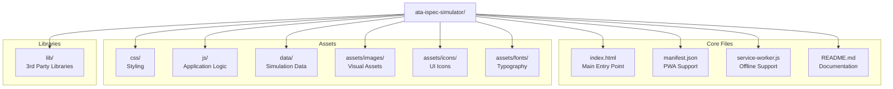

## Hi there 👋


### ATA iSpec 2200 Transformation Simulator: Audience Handout

*GenAI Proposal Status: This document represents a conceptual design generated through AI assistance. Implementation details would require further technical specification and validation by aerospace engineering teams.*

## GAIA-Q-AIR Documentation Transformation Initiative

![GAIA-Q-AIR Logo Placeholder]

### Transforming Aerospace Documentation for the Quantum Age

The GAIA Quantum Aerospace Intelligent Representation (GAIA-Q-AIR) initiative presents a revolutionary approach to aerospace technical documentation. Our ATA iSpec 2200 Transformation Simulator demonstrates how traditional documentation can be transformed into semantically enriched, knowledge-integrated formats that enable next-generation maintenance, training, and regulatory compliance capabilities.

---

## Simulator Highlights

### 1. Semantic Transformation Pipeline

Transform flat documentation into intelligent, interconnected knowledge:

- **Document Ingestion**: Parse ATA iSpec 2200 structured content
- **Content Normalization**: Standardize formats, units, and terminology
- **Entity Recognition**: Identify aerospace components, procedures, and concepts
- **Ontology Alignment**: Map entities to industry-standard aerospace ontologies
- **Validation & QA**: Ensure transformation accuracy and completeness
- **Output Generation**: Create semantically-enriched documentation in multiple formats


### 2. Interactive Knowledge Graph

Visualize complex relationships between aerospace components, procedures, and regulatory requirements:

- **Entity Relationship Mapping**: See how components interact within systems
- **Cross-Reference Navigation**: Navigate between related documents seamlessly
- **Contextual Enrichment**: Access additional information about entities
- **Filtering & Focus**: Isolate specific subsystems or procedure types


### 3. Semantic Annotations

Enhance documentation with intelligent, context-aware annotations:

- **Entity Highlighting**: Visually identify components, procedures, and concepts
- **Tooltip Enrichment**: Access definitions, specifications, and related information
- **Regulatory Linkage**: Connect procedures to relevant regulatory requirements
- **Maintenance History Integration**: Link components to maintenance records


### 4. Configurable Implementation

Tailor the simulator to your organization's specific needs:

- **Content Configuration**: Select transformation stages and features
- **Technical Configuration**: Set compatibility and deployment options
- **Performance Optimization**: Balance detail and performance
- **Branding Customization**: Apply organizational branding
- **Security Controls**: Implement appropriate security measures


---

## Benefits of Semantic Transformation

| Traditional Documentation | Semantically Transformed Documentation
|-----|-----
| Static content | Dynamic, interconnected knowledge
| Format-focused | Meaning-focused
| Siloed information | Integrated knowledge ecosystem
| Linear navigation | Relationship-based exploration
| Manual cross-referencing | Automated relationship discovery
| Text-based search | Semantic query capabilities
| Human-readable only | Both human and machine-readable
| Isolated updates | Propagated changes across related content


---

## Implementation Pathway

1. **Assessment Phase** (2-4 weeks)

1. Document inventory analysis
2. Use case prioritization
3. Technical environment evaluation


2. **Pilot Implementation** (6-8 weeks)

1. Configuration customization
2. Initial document set transformation
3. User acceptance testing


3. **Production Deployment** (3-6 months)

1. Full document set transformation
2. Integration with existing systems
3. User training and adoption support


4. **Continuous Enhancement**

1. Ontology expansion
2. Additional document type support
3. Advanced analytics integration


---

## Ready for a Pilot Project?

The GAIA-Q-AIR team offers a comprehensive pilot package to help your organization experience the benefits of semantic documentation transformation:

- **Customized Simulator**: Configured for your specific documentation needs
- **Sample Document Transformation**: Transform 3-5 of your actual documents
- **Technical Integration Assessment**: Evaluate integration with your existing systems
- **ROI Analysis**: Quantify potential time and cost savings


---

## Contact Information

**Dr. Alexandra Chen**GAIA-Q-AIR Technical Lead[a.chen@gaia-quantum.org](mailto:a.chen@gaia-quantum.org)+1 (555) 123-4567

**Marcus Rodriguez**Implementation Specialist[m.rodriguez@gaia-quantum.org](mailto:m.rodriguez@gaia-quantum.org)+1 (555) 765-4321

---

*© 2025 GAIA Quantum Aerospace Organization. All rights reserved.**Developed in collaboration with the International Aviation Documentation Standards Group and the Semantic Web for Aerospace Research Team.*

---

Would you like me to create any of the other suggested assets, such as a visual slide deck, pilot kit offer details, or impact metrics slide? I'd be happy to develop those materials to complement the presenter's script and this handout.

## 1. Package Manifest Overview



## 2. Detailed File Structure

```plaintext
ata-ispec-simulator/
│
├── index.html                      # Main entry point
├── manifest.json                   # PWA configuration
├── service-worker.js               # Offline support
├── README.md                       # Usage instructions
│
├── css/                            # Styling
│   ├── styles.css                  # Main stylesheet
│   ├── print.css                   # Print-specific styles
│   └── themes/                     # Theme variations
│       ├── light.css               # Light theme
│       └── dark.css                # Dark theme
│
├── js/                             # Application logic
│   ├── simulator.js                # Main application controller
│   ├── config.js                   # Configuration options
│   ├── stages/                     # Stage-specific logic
│   │   ├── stage-manager.js        # Stage navigation controller
│   │   ├── stage-1-ingestion.js    # Document ingestion stage
│   │   ├── stage-2-normalization.js # Content normalization stage
│   │   ├── stage-3-entity.js       # Entity recognition stage
│   │   ├── stage-4-ontology.js     # Ontology alignment stage
│   │   ├── stage-5-validation.js   # Validation & QA stage
│   │   └── stage-6-output.js       # Output generation stage
│   ├── data/                       # Data handling
│   │   ├── data-loader.js          # Data loading utilities
│   │   └── data-processor.js       # Data processing utilities
│   ├── ui/                         # UI components
│   │   ├── ui-controller.js        # UI management
│   │   ├── components/             # Reusable UI components
│   │   └── accessibility.js        # Accessibility enhancements
│   ├── graph/                      # Knowledge graph
│   │   ├── knowledge-graph.js      # Graph visualization
│   │   └── graph-interactions.js   # Graph interaction handlers
│   └── utils/                      # Utility functions
│       ├── export.js               # Export utilities
│       └── helpers.js              # General helper functions
│
├── data/                           # Simulation data
│   ├── document.json               # Sample document structure
│   ├── entities.json               # Entity definitions
│   ├── relationships.json          # Entity relationships
│   ├── ontology.json               # Aerospace ontology
│   ├── validation-rules.json       # Validation rules
│   └── knowledge-graph.json        # Knowledge graph data
│
├── assets/                         # Visual assets
│   ├── images/                     # Images
│   │   ├── illustrations/          # Technical illustrations
│   │   │   ├── hydraulic-system.svg # System schematic
│   │   │   └── component-diagram.svg # Component diagram
│   │   └── screenshots/            # UI screenshots
│   ├── icons/                      # UI icons
│   │   ├── favicon.ico             # Favicon
│   │   ├── logo.svg                # Application logo
│   │   └── stage-icons/            # Stage-specific icons
│   └── fonts/                      # Typography
│       ├── roboto/                 # Roboto font family
│       └── source-code-pro/        # Source Code Pro for code blocks
│
└── lib/                            # 3rd party libraries
    ├── d3.min.js                   # D3.js for visualizations
    ├── pdf-lib.min.js              # PDF generation
    ├── marked.min.js               # Markdown parsing
    └── cytoscape.min.js            # Graph visualization
```

## 3. Key Configuration Options

The `config.js` file contains customizable options that can be modified without changing the core application:

```javascript
// Configuration options for the ATA iSpec 2200 Transformation Simulator
const simulatorConfig = {
  // Content options
  content: {
    includeAllStages: true,           // Include all 6 transformation stages
    includeKnowledgeGraph: true,      // Include knowledge graph visualization
    includeSemanticAnnotations: true, // Include entity highlighting
    includeDocumentation: true,       // Include explanatory content
    defaultStage: 1,                  // Initial stage to display
    exampleDocument: "hydraulic"      // Sample document to use (hydraulic, electrical, etc.)
  },
  
  // Technical options
  technical: {
    offlineSupport: true,             // Enable offline functionality
    responsiveDesign: true,           // Optimize for different screen sizes
    printOptimization: true,          // Include print-specific styles
    accessibilityFeatures: true,      // Enable accessibility enhancements
    preloadAssets: true,              // Preload critical assets
    cacheStrategy: "aggressive"       // Cache strategy (minimal, moderate, aggressive)
  },
  
  // Performance options
  performance: {
    imageQuality: 85,                 // Image quality (50-100)
    minifyCode: true,                 // Use minified code
    lazyLoadImages: true,             // Lazy load non-critical images
    animationLevel: "full"            // Animation level (none, minimal, full)
  },
  
  // Customization
  customization: {
    organizationName: "Aerospace Documentation Division",
    primaryColor: "#0F52BA",          // Primary brand color
    secondaryColor: "#87CEEB",        // Secondary brand color
    logoUrl: "",                      // Custom logo URL
    customCss: "",                    // Additional CSS
    customFooter: ""                  // Custom footer text
  },
  
  // Export options
  export: {
    enablePdfExport: true,            // Enable PDF export
    enableHtmlExport: true,           // Enable HTML snippet export
    enableImageExport: true,          // Enable image export
    enableDataExport: true            // Enable data export
  }
};
```

## 4. Sample Document Data Structure

The `document.json` file contains the structure of the sample ATA iSpec 2200 document:

```json
{
  "documentType": "Aircraft Maintenance Manual",
  "ataChapter": "29",
  "ataSection": "10",
  "ataSubject": "01",
  "title": "Hydraulic Power - Main System - Description and Operation",
  "revision": "24",
  "date": "2023-09-15",
  "effectivity": "ALL",
  "metadata": {
    "documentNumber": "AMM-A320-29-10-01",
    "revisionDate": "2023-09-15",
    "effectivity": "MSN 1000-2000",
    "securityClassification": "Unclassified",
    "exportControl": "ECCN 9E991",
    "copyright": "© Aerospace Manufacturer 2023",
    "language": "en-US",
    "authoringSystem": "XML Editor v5.2",
    "applicability": "A320-200, A320neo"
  },
  "sections": [
    {
      "id": "intro",
      "title": "Introduction",
      "level": 1,
      "content": "This section contains a description of the main hydraulic system and its operation. The hydraulic system supplies hydraulic power for the operation of these aircraft systems: flight control system, landing gear system, nose wheel steering system, and wheel brake system.",
      "children": []
    },
    {
      "id": "description",
      "title": "Description",
      "level": 1,
      "content": "",
      "children": [
        {
          "id": "general",
          "title": "General",
          "level": 2,
          "content": "The hydraulic system operates at a nominal pressure of 20684 kPa (3000 psi) and includes these main components: engine-driven hydraulic pumps (quantity: 2), electric-driven hydraulic pump (quantity: 1), hydraulic reservoirs (quantity: 2), hydraulic filters (quantity: 4), hydraulic accumulators (quantity: 3), pressure relief valves (quantity: 2).",
          "children": []
        },
        {
          "id": "components",
          "title": "Major Components",
          "level": 2,
          "content": "",
          "children": [
            {
              "id": "pumps",
              "title": "Hydraulic Pumps",
              "level": 3,
              "content": "The hydraulic system uses these pumps: engine-driven hydraulic pumps (quantity: 2) - These pumps are the primary source of hydraulic pressure during normal operation; electric-driven hydraulic pump (quantity: 1) - This pump operates as a backup system.",
              "children": []
            },
            {
              "id": "reservoirs",
              "title": "Reservoirs",
              "level": 3,
              "content": "The hydraulic system includes two reservoirs that store hydraulic fluid. Each reservoir supplies hydraulic fluid to its respective hydraulic system.",
              "children": []
            }
          ]
        }
      ]
    }
  ],
  "illustrations": [
    {
      "id": "fig-1",
      "title": "Hydraulic System Schematic",
      "filename": "hydraulic-system.svg",
      "pageNumber": 3
    },
    {
      "id": "fig-2",
      "title": "Hydraulic Pump Installation",
      "filename": "pump-installation.svg",
      "pageNumber": 5
    }
  ],
  "tables": [
    {
      "id": "table-1",
      "title": "System Specifications",
      "data": [
        ["Parameter", "Value", "Unit"],
        ["Operating Pressure", "3000", "psi"],
        ["Maximum Flow Rate", "15", "gpm"],
        ["Reservoir Capacity", "5", "gallons"]
      ],
      "pageNumber": 2
    }
  ]
}
```

## 5. Entity Data Structure

The `entities.json` file contains the extracted entities from the document:

```json
{
  "entities": [
    {
      "id": "sys-1",
      "type": "system",
      "text": "hydraulic system",
      "confidence": 0.98,
      "properties": {
        "ataChapter": "29"
      },
      "occurrences": [
        {"sectionId": "intro", "startOffset": 45, "endOffset": 61},
        {"sectionId": "general", "startOffset": 4, "endOffset": 20}
      ]
    },
    {
      "id": "comp-1",
      "type": "component",
      "text": "engine-driven hydraulic pump",
      "confidence": 0.97,
      "properties": {
        "quantity": 2,
        "partNumber": "HYD-PUMP-001"
      },
      "occurrences": [
        {"sectionId": "general", "startOffset": 108, "endOffset": 136},
        {"sectionId": "pumps", "startOffset": 31, "endOffset": 59}
      ]
    },
    {
      "id": "param-1",
      "type": "parameter",
      "text": "20684 kPa",
      "confidence": 0.99,
      "properties": {
        "unit": "kPa",
        "value": 20684,
        "imperialEquivalent": "3000 psi"
      },
      "occurrences": [
        {"sectionId": "general", "startOffset": 45, "endOffset": 54}
      ]
    }
  ],
  "relationships": [
    {
      "id": "rel-1",
      "type": "part-of",
      "sourceId": "comp-1",
      "targetId": "sys-1",
      "confidence": 0.97
    },
    {
      "id": "rel-2",
      "type": "generates",
      "sourceId": "comp-1",
      "targetId": "param-1",
      "confidence": 0.93
    }
  ]
}
```

## 6. Knowledge Graph Data Structure

The `knowledge-graph.json` file contains the knowledge graph representation:

```json
{
  "nodes": [
    {
      "id": "sys-1",
      "label": "Hydraulic System",
      "type": "system",
      "class": "HydraulicSystem",
      "properties": {
        "ataChapter": "29",
        "operatingPressure": "3000 psi"
      }
    },
    {
      "id": "comp-1",
      "label": "Engine-Driven Hydraulic Pump",
      "type": "component",
      "class": "HydraulicPump",
      "properties": {
        "partNumber": "HYD-PUMP-001",
        "quantity": 2,
        "manufacturer": "Aerospace Components Inc."
      }
    },
    {
      "id": "comp-2",
      "label": "Electric-Driven Hydraulic Pump",
      "type": "component",
      "class": "HydraulicPump",
      "properties": {
        "partNumber": "HYD-PUMP-002",
        "quantity": 1,
        "powerSource": "Electric"
      }
    }
  ],
  "edges": [
    {
      "source": "comp-1",
      "target": "sys-1",
      "label": "partOf",
      "properties": {
        "confidence": 0.97
      }
    },
    {
      "source": "comp-2",
      "target": "sys-1",
      "label": "partOf",
      "properties": {
        "confidence": 0.96
      }
    }
  ],
  "ontologyClasses": [
    {
      "id": "HydraulicSystem",
      "label": "Hydraulic System",
      "superClass": "AircraftSystem",
      "properties": [
        "operatingPressure",
        "fluidType",
        "reservoirCapacity"
      ]
    },
    {
      "id": "HydraulicPump",
      "label": "Hydraulic Pump",
      "superClass": "Component",
      "properties": [
        "flowRate",
        "pressureRating",
        "driveType"
      ]
    }
  ]
}
```

## 7. Usage Instructions (README.md)

```markdown
# ATA iSpec 2200 Transformation Simulator

Interactive visualization of the document transformation process from ATA iSpec 2200 format to semantically enriched, knowledge graph-integrated technical documentation.

## Quick Start

1. Extract the ZIP file to a local directory
2. Open `index.html` in a modern web browser (Chrome, Firefox, Safari, or Edge)
3. Navigate through stages using the stage tabs or next/previous buttons
4. Interact with visualizations to explore the transformation process

## Features

- Interactive visualization of all 6 transformation stages
- Knowledge graph exploration
- Semantic entity highlighting
- Offline functionality
- Print-optimized layout
- Responsive design for desktop and tablet viewing

## System Requirements

- Modern web browser (Chrome, Firefox, Safari, Edge)
- JavaScript enabled
- 1024×768 minimum screen resolution
- 4GB RAM recommended for knowledge graph visualization

## Configuration

The simulator can be configured by editing the `js/config.js` file. See comments in that file for available options.

## Offline Usage

This package includes offline support via a service worker. Once loaded in a browser while online, the simulator will be available offline on subsequent visits.

## Printing

Use your browser's print function (Ctrl+P or Cmd+P) to create a PDF of the current stage. Print-specific styles are included to optimize the output.

## Troubleshooting

If visualizations do not appear:
1. Ensure JavaScript is enabled
2. Try a different browser
3. Check browser console for errors

## License

© 2025 Aerospace Documentation Division. All rights reserved.
```

## 8. Implementation Notes

### 8.1 Browser Compatibility

The package is designed to work with:

- Chrome 90+
- Firefox 88+
- Safari 14+
- Edge 90+


Internet Explorer is not supported.

### 8.2 Accessibility Features

The package includes:

- ARIA attributes for screen reader support
- Keyboard navigation for all interactive elements
- Sufficient color contrast (WCAG AA compliant)
- Text alternatives for all non-text content
- Focus indicators for keyboard users


### 8.3 Performance Optimizations

- Critical CSS inlined in the head
- Deferred loading of non-critical JavaScript
- Image optimization (WebP format with fallbacks)
- Lazy loading of off-screen images
- Minified and compressed assets


### 8.4 Security Considerations

- No external dependencies or CDN links
- All resources loaded from local package
- Content Security Policy implemented
- No sensitive data included in the package


## 9. Would you like to initiate a live configuration session?

If you'd prefer to initiate a live configuration session instead of using this sample manifest, I can guide you through the process of:

1. Selecting specific content options for your use case
2. Customizing the technical parameters
3. Configuring performance settings
4. Adding organization-specific branding
5. Generating a customized package tailored to your requirements


Would you like to proceed with a live configuration session, or would you prefer to use this sample manifest as a starting point?
**Here are some ideas to get you started:**

🙋‍♀️ A short introduction - what is your organization all about?
🌈 Contribution guidelines - how can the community get involved?
👩‍💻 Useful resources - where can the community find your docs? Is there anything else the community should know?
🍿 Fun facts - what does your team eat for breakfast?
🧙 Remember, you can do mighty things with the power of [Markdown](https://docs.github.com/github/writing-on-github/getting-started-with-writing-and-formatting-on-github/basic-writing-and-formatting-syntax)
-->
